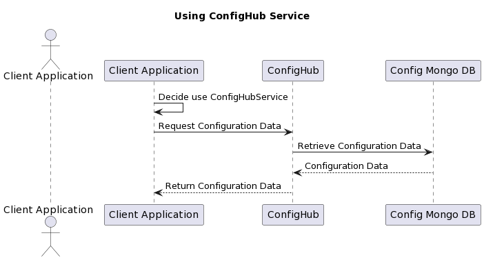
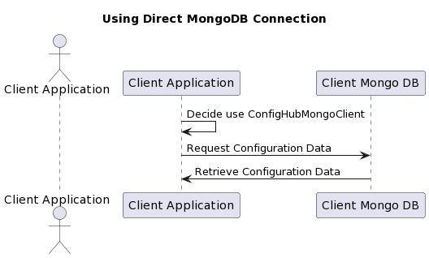

# ConfigHub - Configuration as a Service

ConfigHub is a configuration-as-a-service component built using .NET 6 and MongoDB. It provides a centralized solution to store and manage configuration data for multiple applications (clients). Each application can have multiple components, and each component can have multiple configuration keys.

# ConfigHub Features

ConfigHub is a flexible configuration management system designed to simplify handling of application configuration data. It offers the following features:

- **ConfigHub.Client Library:**
  - Client-side library to interact with the ConfigHub service.
  - Supports both service-based and MongoDB-based configurations.
  - Extension method to integrate ConfigHub.Client into ASP.NET Core applications.
  - Easily configure client options including service URL, client certificate, etc.
- **Linked COnfiguration**
  - Enhance configuration management by reusing values across components using the LinkedKey property in cofnig item

- **MongoDB Integration:**
  - Store configuration data in MongoDB.
  - MongoDB repository with CRUD operations for configuration items.

- **Certificate Authorization:**
  - Supports certificate mapping for application identity.
  - Store certificate-thumbprint to application ID mapping in MongoDB.

- **In-Memory Cache:**
  - In-memory caching for frequently used configuration data.
  - Caches data retrieved from service endpoints.
  - Load and cache configuration data for a component at initialization.
  - Fetches and caches data as needed.

- **Data Encryption:**
  - Encryption and decryption of sensitive configuration values.
  - AES encryption with random IV.

- **API Endpoints:**
  - Exposes API endpoints to retrieve configuration items based on component and key.
  - Supports fetching all configuration items for a component.

- **Customization via Options:**
  - Customizable options class to configure ConfigHub.Client behavior.
  - Includes options for service URL, certificate, MongoDB connection, etc.

## Project Structure

The solution consists of the following projects:

### ConfigHub.API

This project contains the Web API that exposes endpoints for fetching configuration data. It provides endpoints to retrieve configuration data based on the component and key names. The client certificate authentication for secure access is in progress.

### ConfigHub.Client

The ConfigHub.Client project contains the client library that allows other applications to consume the ConfigHub API. It provides an easy-to-use interface to interact with the API and fetch configuration data.

### ConfigHub.Domain

This project contains the domain models and interfaces used by both the API and the client. It defines the data models for configuration items and other shared entities.

### ConfigHub.Infrastructure

The ConfigHub.Infrastructure project contains the implementation of the interfaces defined in the domain project. It includes the MongoDB repository and the configuration service, which interact with the database to store and retrieve configuration data.

### ConfigHub.Mongo

The ConfigHub.Mongo project contains the MongoDB context and the generic repository factory. The context provides access to the MongoDB database, and the repository factory generates the generic repository for a specific collection and database name.

### ConfigHub.Shared

The ConfigHub.Shared project contains shared enums and common utilities used across the solution  

---

# How to Use ConfigHubClient

The ConfigHubClient is a client library that allows applications to consume the ConfigHub API and fetch configuration data. To use the ConfigHubClient in your application, follow these steps:

### Register ConfigHubClient with Dependency Injection

In your application's Startup.cs or a similar configuration file, register the ConfigHubClient with dependency injection.

#### Scenario 1: Using ConfigHub Service

If you want to use the ConfigHub service for configuration data, provide the required options such as `BaseAddress`, `ClientCertificate`, and `ApplicationId`.

```csharp
services.AddConfigHubClient(new ConfigHubOptions
{
    UseConfigHubService = true,
    BaseAddress = "https://confighub.example.com",
    ClientCertificate = new X509Certificate2("path/to/certificate.pfx", "certificatePassword"),
    ApplicationId = "YourApplicationId"
});
```


#### Scenario 2: Using Direct MongoDB Connection

If you prefer to connect directly to MongoDB for configuration data, provide the necessary MongoDB options such as `ConnectionString`, `DatabaseName`, and `ConfigCollectionName`.

```csharp
services.AddConfigHubClient(new ConfigHubOptions
{
    UseConfigHubService = false,
    ConnectionString = "mongodb://localhost:27017",
    DatabaseName = "YourDatabaseName",
    ConfigCollectionName = "YourConfigCollectionName"
});
```


ConfigHub provides a centralized and secure solution for managing configuration data. By using the ConfigHub.Client library, you can easily consume the ConfigHub API in your application, ensuring that your application always has the most up-to-date configuration settings. Feel free to use and customize this solution for your configuration management needs. If you have any questions or issues, please feel free to reach out to us or open an issue on GitHub.

Happy coding! 😊
